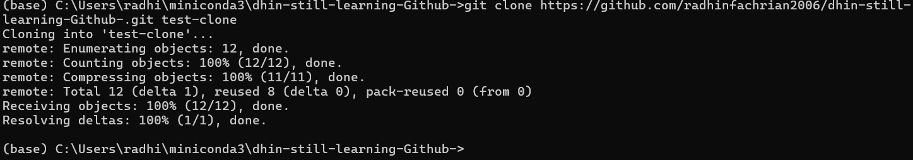
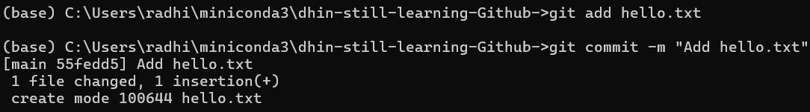
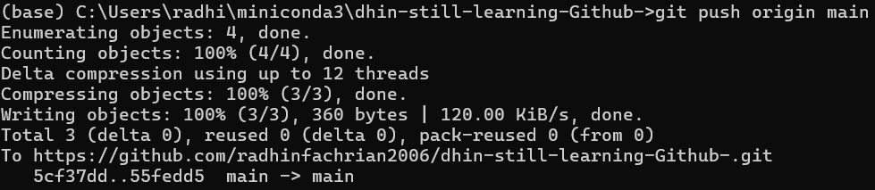
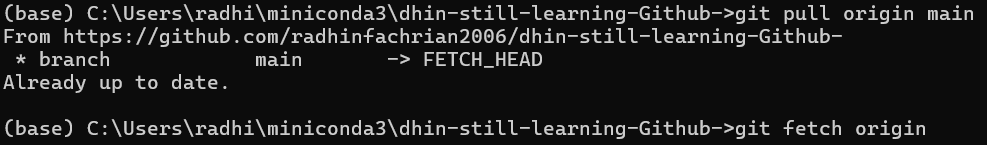
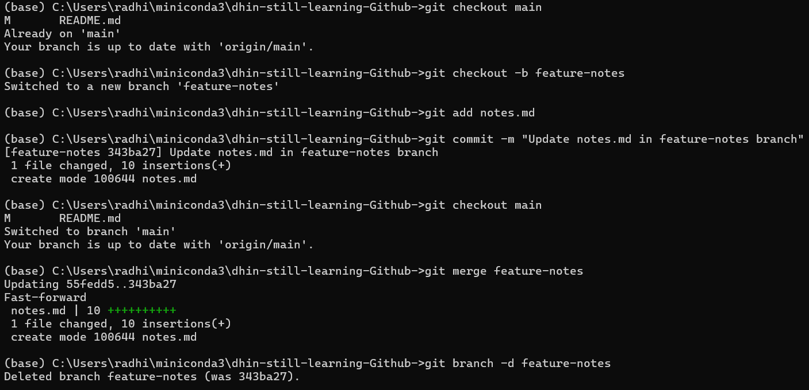

# 📘 Assignment Report - Git Practice  
Repository: **dhin-still-learning-Github-**

Dokumentasi percobaan perintah dasar Git sesuai tugas.  
Semua bukti dilengkapi dengan command dan screenshot hasil.

---

## 1. Clone
- Command:
  ```bash
  git clone https://github.com/radhinfachrian2006/dhin-still-learning-Github-.git
evidence : 

## 2. Add & Commit
evidence : 
Result: File hello.txt berhasil ditambahkan ke repository lokal.

## 3. Push 
evidence : 
Result: Perubahan berhasil dikirim ke repository GitHub.

## 4. Pull
evidence : 
Result: Repository lokal sinkron dengan repository GitHub.

## 5. Merge
evidence : 
Result: Perubahan dari branch feature-notes berhasil digabung ke branch main.

## 6. Summary
Dalam percobaan ini saya sudah mempelajari:

Cara clone repo dari GitHub.

Cara add, commit, dan push perubahan.

Cara pull/fetch untuk sinkronisasi.

Cara membuat branch baru dan melakukan merge.

📌 Catatan: Masih perlu latihan lebih dalam untuk mengatasi merge conflict agar lebih terbiasa.
✍️ Author: Radhin Fachrian